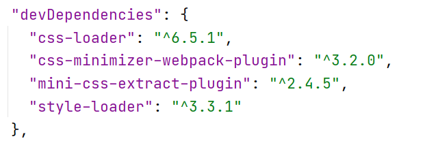

## npm (Node Package Manager) - пакетный менеджер для JavaScript, работающий на Node.js.

## [package.json](https://docs.npmjs.com/cli/v7/configuring-npm/package-json)

package.json файл содержит список пакетов, которые необходимы проекту. Команда `npm init` генерирует данный файл и
запрашивает:

1. name - название проекта,
2. version - версия проекта,
3. description - описание проекта,
3. license - лицензия проекта.

`npm init -y` для быстрой генерации package.json файла.

### dependencies / devdependencies в package.json

dependencies и devdependencies - словари с именами библиотек (ключи) и их версии (значения).
<b>dependencies</b> предназначены для использования в продакшене, <b>dependencies</b> - для использования в разработке.

Например,

    dependencies и devdependencies

### package-lock.json

Файл package-lock.json генерируется автоматически и содержит полное дерево необходимых зависимостей.

### npm команды для установки зависимостей

`npm install название_библиотеки --save-dev` - устанавливает необходимую библиотеку, которая будет использована в
разработке;

`npm install название_библиотеки --save` - устанавливает необходимую библиотеку, которая будет использована в
продакшене;

`npm install` - устанавливает все зависимости, описанные в package.json файле;

`npm install --production` - установит только нужные для работы приложения зависимости из dependencies в package.json
файле;

`npm ci` - устанавливает модули руководствуясь package-lock.json файлом;

`npm audit` - предоставляет информацию об уязвимостях в пакетах и о существовании версий с исправлениями;

`npm audit fix` - автоматически обновит версии затронутых зависимостей;

`npm uninstall название_библиотеки --save/--save-dev` - для удаления зависимости.

### scripts в package.json
Поле scripts используется для автоматизации сборки. Ключи в scripts - названия команд, значения — сами команды.

# Плагины и библиотеки
## WebPack - инструмент сборки frontend

`npm install webpack webpack-cli --save-dev` - установка

        webpack.config.js:

        const webpack = require('webpack');
        const path = require('path');

        module.exports = (env, argv) => {
            const devMode = argv.mode !== 'production';
            return {
                mode: "production",
                entry: {},
                output: {},
                plugins: [],
                module: {},
                optimization: {},
                devServer: {}
            }
        }

## CleanWebpackPlugin - очищает папку dist перед каждой сборкой

`npm install clean-webpack-plugin --save-dev` - установка

## Babel - полифил, переписывает современный JavaScript-код в предыдущий стандарт

`npm install @babel/core @babel/preset-env babel-loader --save-dev` - установка

        webpack.config.js:

         module: {
             rules: [
                {
                    test: /\.js$/,
                    exclude: /node_modules/,
                    use: ['babel-loader'],
                }
             ]
         }

## HtmlWebpackPlugin - для генерации html-файлов по шаблону

`npm install html-webpack-plugin --save-dev` - установка

        webpack.config.js:

        const HtmlWebpackPlugin = require('html-webpack-plugin');
        const PAGES = ['index', 'contacts'];

        plugins: [
            ...PAGES.map((page) => new HtmlWebpackPlugin({
                    title: page.toUpperCase(),
                    template: `src/${page}.html`,
                    filename: `${page}.html`,
                    chunks: [page],
                    inject: false,
                })
            ),
        ],

## CssLoader - преобразовывает CSS в модуль JavaScript

## StyleLoader - стили интегрированы в js и отображаются на странице в теге style

## MiniCssExtractPlugin - распаковывает css в отдельные файлы

## CssMinimizerWebpackPlugin - минифицирует css файлы

`npm install css-loader style-loader css-minimizer-webpack-plugin mini-css-extract-plugin --save-dev` - установка

        webpack.config.js:

        const MiniCssExtractPlugin = require("mini-css-extract-plugin");
        const CssMinimizerPlugin = require("css-minimizer-webpack-plugin");

        plugins: [
            new MiniCssExtractPlugin({
                filename: "css/[name].css",
            }),
        ],
        module: {
            rules: [
                {
                    test: /\.(sa|sc|c)ss$/i,
                    exclude: /node_modules/,
                    use: [
                        devMode ? 'style-loader' : MiniCssExtractPlugin.loader,
                        'css-loader'
                    ],
                },
                // загрузка изображений
                {
                    test: /\.(png|svg|jpg|jpeg|gif)$/i,
                    exclude: /node_modules/,
                    type: 'asset/resource'
                },
            ]
        },
        optimization: {
            minimizer: [
                `...`,
                new CssMinimizerPlugin({
                    minimizerOptions: {
                        preset: [
                            'default',
                            {
                                discardComments: {removeAll: true},
                            },
                        ],
                    },
                }),
            ],
        },

## Sass и SassLoader - для работы с sass файлами

`npm install sass sass-loader --save-dev` - установка

        webpack.config.js:

        module: {
            rules: [
                {
                    test: /\.(sa|sc|c)ss$/i,
                    exclude: /node_modules/,
                    use: [
                        devMode ? 'style-loader' : MiniCssExtractPlugin.loader,
                        'css-loader',
                        'sass-loader'
                    ],
                }
            ]
        },

## WebpackDevServer - для запуска сервера разработки

`npm install webpack-dev-server --save-dev` - установка

        webpack.config.js:

        const WebpackDevServer = require('webpack-dev-server');

        devServer: {
            static: './dist',
            port: 9000,
            client: {
                logging: 'warn', // 'log' | 'info' | 'warn' | 'error' | 'none' 
                overlay: false,
            }
        },

## ImageMinimizerWebpackPlugin - для сжатия изображений

[Данный плагин](https://webpack.js.org/plugins/image-minimizer-webpack-plugin/#root) работает совместно 
с [imagemin плагинами](https://www.npmjs.com/search?q=keywords:imageminplugin)

`npm install image-minimizer-webpack-plugin --save-dev` - установка

        webpack.config.js:

        const ImageMinimizerPlugin = require("image-minimizer-webpack-plugin");

        plugins: [
            new ImageMinimizerPlugin({
                filter: (source, sourcePath) => source.byteLength >= 8192,
                minimizerOptions: {
                    plugins: [
                        ["имя плагина imagemin", { настройки }],
                        ["имя плагина imagemin", { настройки }]
                    ]
                },
            }),
        ],

## CopyWebpackPlugin - копирует файлы в папку dist без изменений

`npm install copy-webpack-plugin --save-dev` - установка

        webpack.config.js:

        const CopyPlugin = require("copy-webpack-plugin");

        plugins: [
            new CopyPlugin({
                patterns: [
                    {
                        from: "src/img/fox.jpg",
                        to: "images"
                    },
                ],
            }),
        ]

